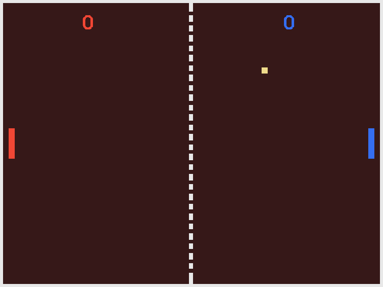

# SUPERPOWERS TUTORIAL #1 SUPER PONG
## *Chapter 1 : Introduction and Plan the game*

### Introduction to the new comer who dream to become a game developer

We are going to build a Pong game, it is a simple game that will be an opportunity for us to discover Superpowers as an empowering tool to build video games. It is a first step that can seem simple, but understanding this first step of what is game development is really important before going on the next step and building our next game, and even to continue after that to do many games in an iterative process until we build the wonderful game we have in the mind and want to bring to life.

Don't quit with the first difficulties or mistakes (which in fact are really important for the learning process) and don't let yourself build the belief than you are not 'made' for this and others are better than you, that's not true, everyone can do anything with patience and a playful mind. Always start from where you are and not from where you should be.

Making game can be really difficult and game developers succeed not because they are different than you but mainly because they engage a LOT of time in it, they are building their skills step by step, do a lot (a LOT) of mistakes and they don't have the belief they won't be able to learn something new from them, oh and also they enjoy a lot the simple process of building games because just focusing on the end result can be really frustrating and tiresome. Focus on now, the future take care of itself.

I know that game development can be impressive from the point of view of the newcomer who looks behind the scene of games they like to play. But believe me, this impressiveness is an illusion built by a huge amount of time and dedication. Don't lose time thinking you aren't able to do the same, step up to become game developer right now if it is what your dream is about.

Ok, let's make a first game.

### Plan the game

We will make [Pong][1], two players trying to catch a ball and earn points if the other player fail to catch it back.

Pong is a kind of symbol in the young video game history, as it is one of the first graphical video game. I think it is also a nice starter for learning the basics of Superpowers.

You can [play the game here][2] if you want to see what we will do.

Our game will have the following features than we will build step by step:

* A table background, in which the game takes place.
* Two paddles that each player can control with the keyboard.
* One ball that moves and bounces off the table sides and off the paddles.
* A score displaying the points.
* A menu with a start button and game instructions.

We will build the game without computer artificial intelligence, meaning than we will need two players to play the game, we can also have great fun doing a competition between our left and right hand. My left hand always win, she has more training playing with the keyboard I guess... :)

*(I will do others tutorials later that add AI to this game and others)*

Next: [Preparing Superpowers](ch2.md#chapter-2--preparing-superpowers)

[1]: https://en.wikipedia.org/wiki/Pong
[2]: http://mseyne.itch.io/pong
