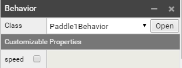

# SUPERPOWERS TUTORIAL #1 SUPER PONG
## *Chapter 3 : programming the game logic*

### Introduction

If you don't know nothing about Programming in Javascript (which TypeScript is based on)
you will maybe need to look at a tutorial to have a first idea (like the track JavaScript on Khan Academy).
Don't worry, coding/programming is not as difficult as we could imagine, it is about
solving real problems with logic and not much about abstraction. It is important to not
go fast and take the time to understand basic concepts. You could feel it is really
slow and abstract to get a really simple thing, but it will go faster and more concrete
as you understand by practicing this steps (the frustration comes often when we try
  to do something we aren't prepared to do).

However you can continue the tutorial and try to understand the basics by jumping in 
right now and copying the code below in Superpowers, by repetition and practice alone,
exploring and testing, making mistakes and repairing them (which we call debugging,
a fundamental concept in programming, where errors and mistakes are not to be avoid
but understood) slowly but confidently, you will make amazing progress.

### Scripting the paddles behaviors

We can now start to code the logic of our game, starting by implementing the movement of the paddles.

In our folder GameScripts, we will start to code in the script Paddles. You will have a default script, but
let's remove it all and write this template instead:

```TypeScript
class Paddle1Behavior extends Sup.Behavior {

  update() {

  }
}

class Paddle2Behavior extends Sup.Behavior {

  update() {

  }
}

Sup.registerBehavior(Paddle1Behavior);
Sup.registerBehavior(Paddle2Behavior);
```

We will work in the first Class Paddle1Behavior, and the second Class Paddle2Behavior will be almost the same.

We define variables for the Class, **pad** which will be a connection to the body of our
scene and a number **speed**. We write under the Class line :

```TypeScript
class Paddle1Behavior extends Sup.Behavior {
    // connect the paddle body to a variable which will be used many times in the script
    pad = this.actor.arcadeBody2D;
    // set the speed of the paddle
    speed : number = 0.1;
[...]
```

We will use a condition **if** and the command **Sup.Input** which is important in Superpowers
to be able to get user input, which is the way player can have control in the game with
the mouse, the keyboard, the gamepad or his fingers on mobile.

We need a way to say to the sprite body to move if we press a keyboard key. We use the command
setVelocityY (because for the paddle we will move only on the y axis).

We also need to check if the paddle don't go out of the screen and we need to limit
maximum and minimun until which the paddle can go up and down. To do so, we will
keep track of the Y position of our paddle and add in our condition the possibility
to move the paddle only if the y is under a maximum y and above a minimum y.

In the **update** method we write our script as follow.

```TypeScript
[...]
update() {

    // get Y position of paddle in a variable
    let y : number = this.actor.getY() ;

    // if the key W is pressed and y < to max, the velocity of the body is set in motion with speed
    if(Sup.Input.isKeyDown("W") && y < 2.35){
      this.pad.setVelocityY(this.speed);
    }
    // if the key S is pressed and y > to min, the velocity of the body is set in motion with negative speed
    else if(Sup.Input.isKeyDown("S") && y > -2.35){
      this.pad.setVelocityY(-this.speed);
    }
    // in other situations the velocity of the body is set to 0
    else{
      this.pad.setVelocityY(0);
    }

  }
[…]
```

To try our Behavior we need to attach it to our Actor in the Scene. In the Paddle of
player1 create a new component **Behavior** and choose the class Paddle1Behavior.



We can now start our program and we should be able to see the paddle moving up and
down with the key W and S.

We can copy our code into the Class Paddle2Behavior, but instead
of W and S we change the Sup.Input.isKeyDown to 'UP' and 'DOWN'. We will use this for the second paddle.

In the same way than before, we attach the script in the Scene Game to the paddle of player 2.
(new component>Behavior), we choose the class Paddle2Behavior.


### Scripting the ball behavior

We can now start to code the movements of the ball in the asset script Ball in the folder
GameScripts. This Script will be contain more than the script paddles because we will
write the collisions and the scores systems inside the same Class.

We won't use the start method, so we can remove it from the default template. We should now have now as a starter script:

```TypeScript
class BallBehavior extends Sup.Behavior {

  update() {

  }
}
Sup.registerBehavior(BallBehavior);
```
Because our ball will have acceleration we can now add the default/starting speed, which
will be a constant that we will refer to. We put our constant outside of the main Class -
in won't matter in this game, but in other games, this constant could be then used in
other Classes of the game, so it is a good habit to get used to.

```TypeScript
const BALLSPEED : number = 0.05 ;
class BallBehavior extends Sup.Behavior {
[…]
```

We will now add our variables to BallBehavior:

  * one for the speed of the moving ball, starting from our constant BALLSPEED (it will accellerate)
  * one Array which contain both scores of player1 and player2
  * two variables that will be flags positive or
negative which will give us the x/y direction of the ball (for example if the ball goes up and touches the up side of the game table, the variable will take the oposite value, telling us than the ball should move in the oposite direction)

```TypeScript
[…]
class BallBehavior extends Sup.Behavior {
    // speed variable
    speed : number = BALLSPEED;
    // Connect the actor body to a constant
    ball = this.actor.arcadeBody2D;
    // An Array with score[0] for player 1 and score[1] for player 2
    score = [0, 0];
    // set positive or negative direction variables of x and y
    dx : number = 1; dy : number = 1;
[…]
```

We write different conditions for different cases :

1. If the ball touches the up or down sides of the table, the ball will  direction the on y axis and continue to move on the same x axis. We will  check a condition and if true, change the variable **dy**.

2. If the ball collides with the paddles, the ball take a little acceleration and goes in
the opposite direction on the x axis while stay the same on y axis (if the ball collides with left or right side of the paddle).
We will use the **Sup.ArcadePhysics2D.collides** method to check if the Physics Bodies
of the ball and the paddles collides together. We will also have a second check of the side of the ball collision with the method **getTouches**.

3. If the ball touches the right or left side (when the paddle misses the ball), a score is made for the player who made the goal (we will see this point a bit later), and the ball returns to the center and resumes with the default speed.

Ok, now we write the behavior of the ball inside the loop method update.

```TypeScript
[…]
  update() {

    // get the ball position of x and y

    let x : number  = this.actor.getX(); let y : number  = this.actor.getY();

    // change direction of y if ball reach up and down sides

    if(y > 2.85 || y < -2.85){
      this.dy = this.dy * -1;
    }

    // We check if there is collision between the ball and the two paddles

    if(Sup.ArcadePhysics2D.collides(this.ball, Sup.ArcadePhysics2D.getAllBodies())){

      /* If there is collision we check if the ball touch
      a left or right side (we change the x direction) or
      the up and down side of the paddles (y direction),
      the speed of the ball take an acceleration. */

      if(this.ball.getTouches().right || this.ball.getTouches().left){
        this.dx = this.dx * -1;
        this.speed += 0.01
        }
      else {
        this.dy = this.dy * -1;
        }

      }

    /* We check if the ball pass the paddle and go beyond
    (sides left and right of the game table) if yes, we move
    the ball to the center and change the direction of x axis,
    the speed take the default speed. */

    if(x > 4 || x < -4){
       this.ball.warpPosition(0, 0);
       this.dx = this.dx * -1;
       this.speed = BALLSPEED;
       }

    // set ball movement velocity speed*direction for x and y axis (the ball stay in movement at any time)

    this.ball.setVelocity(this.speed*this.dx, this.speed*this.dy);

  }
[…]
```


To see the script in action we need to do the same thing we did to test the paddles: attach the
script Ball in the Scene Game to the Actor Ball. (new component>behavior, class = BallBehavior)

We should have now a game working nicely.

### Scoring system

We will now add a simple scoring system. What we want is that player who gets the ball in the other camp scores one point (the score increments by one).

To do so, we add two conditions at the end of our class BallBehavior, one for the
case that the ball touches the side of player 1 and one for the side of player 2.

We use then the **textRenderer** method to change the display of the score that we connect with
the method getActor('Player1').getChild('Score') for the score of player 1 and getActor('Player2').getChild('Score')
for the score of player 2.

```TypeScript
[...]
    //We change the score depending on which side the ball go on x axis
    if(x > 4){
      ++this.score[0];
      Sup.getActor("Player1").getChild("Score").textRenderer.setText(this.score[0]);
    }

    if(x < -4){
      ++this.score[1];
      Sup.getActor("Player2").getChild("Score").textRenderer.setText(this.score[1]);
    }

    // set ball movement velocity speed*direction for x and y axis (the ball stay in movement at any time)
    this.ball.setVelocity(this.speed*this.dx, this.speed*this.dy);
  }
}
Sup.registerBehavior(BallBehavior);
```

The game logic is finished, we just need to polish it a bit before release - but now we have our game.
