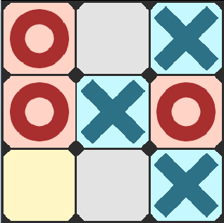

# SUPERPOWERS TUTORIAL #2 SUPER OXO
## *Chapter 1 : Introduction*

### Planning the Game

We are going to make a [Tic Tac Toe][1] game, it is a very simplistic strategy
game that is a perfect project for introducing video game development.

The game is turn based on a 3x3 squares grid, the player and the computer try to
align 3 cross or 3 circle to win.

This tutorial is more a programming tutorial than was the previous one (pong) but
the powerful tool of Scene from Superpowers will still be very useful to help us to
build the main graphical structure without the need to think much about it during our code writing.

One of the super power of superpowers is to allow us to separate clearly what is
the game logic from what is the visual elements of our game, we will use this ability.

### MVG Features

Here the minimum viable game (MVG) features we want :

* Player is cross, Computer is circle.
* A grid 3x3 where each square can be empty, cross or circle.
* The player can control the mouse to choose which square to play.
* A simple computer artificial intelligence checking the game board to decide how to play against the player.
* A function that find out if the player or the computer won, or if the game is a tie.

*Note about the video game history : Built in 1952,* [OXO][2] *is the first graphical
known video game, the game was not made public and was only intended for academic research purposes.*

[1]: https://en.wikipedia.org/wiki/Tic-tac-toe
[2]: https://en.wikipedia.org/wiki/OXO
