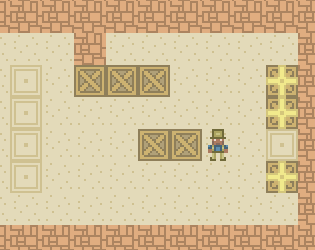

# SUPERPOWERS TUTORIAL #3 : SUPER SOKOBAN
## *Chapter 1 : Introduction*

### Plan the game

In this tutorial we will learn to make a [Sukoban Game][1],

It consist of different levels composed of tiles where each tile is either a floor or a wall.

Some floor tiles are covered with boxes, and some other floor tile are marked as
storage target, there is the same amount of box and storage location in one level.

The player may move horizontally or vertically onto empty floor tile (but is always blocked by a wall).

The player can move into a box, which pushes it into the tile beyond if the next tile
beyond is not blocked by a wall or an other box. If the box cannot be pushed, the player is blocked.

Pass to the next level and win the game is to solve the differents puzzles by moving
 each box to one storage location.

***Note about the video game history:*** *The first* [Sokoban][1] *was released in 1982 and since
 then have known many sequels or variants, but the core puzzle gameplay remained
 mostly the same until today. You can play thousands of differents puzzles patterns
 on this [web site][2].*

### Features we need for a minimal viable game

* A moving character on a tiled map
* The character blocked by wall and boxes
* Pushing box on free space or target destination
* Changing level when puzzle solved

### Advices about the learning process for game development

If you are doing this game for the first time, I recommend you to follow step by
step the process because what is important is to make it work for you, after that
you can then do it a second time with the modification you wish, breaking the code
and do any kind of tests you want for the purpose of understanding how the game work
in details and finally, I recommend you do it a third time from scratch without
looking at the tutorial only as a reference when you are blocked, facing the
problems by yourself and solving them is the best way to learn and keep in long
term memory the process of game making and progamming. It is how I conceive learning
video game development for this tutorial series, my philosophy : learn by doing it
three times, deeper each time. :-)

[1]: https://en.wikipedia.org/wiki/Sokoban
[2]: http://sokoban.info/
