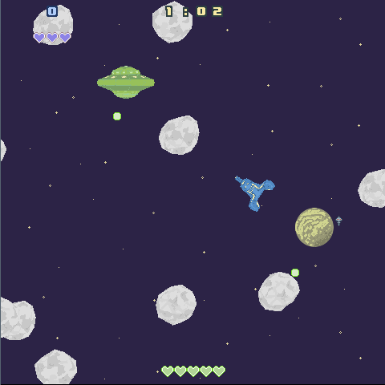
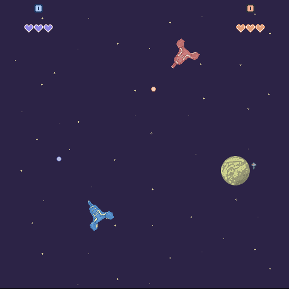

# SUPERPOWERS TUTORIAL #4
## SUPER ASTEROIDS and SUPER SPACEWAR, Chapter 1 

### **Planning the game**

We will build three games in one, inspired by :

* [Spacewar][1] (or Spacewar!) is one of the first video game created in 1962, it consist more or less of a simple fight between two ships.

* [Asteroids][2] is a famous arcade shooter released in 1979, it's gameblay involve a ship avoiding and shooting asteroids and aliens ships.

* [Star Castle][3] is a famous arcade shooter released in 1980, this game will be build as a mod example, it imply shooting an Alien ship by first detroying the armor that protect it.

### **Game features**

* One or two player game (the asteroids clone is single player, the spacewar clone is multiplayer).
* Player ship moving and shooting.
* Asteroids moving and rotating randomly in the game space.
* Alien ship shooting to the player.
* Score system, asteroids, alien or ship give points.
* Simple HUD, timer, score and life of the player(s).
* Simple Game Menu.
* Game over screen and show the player (s) score.
* Point and explosion appear where the Actor is destroyed.
* Infinite scrolling background.
* Complete collision system between actors (ships, missiles, asteroids, alien).
* An easy way to reuse the game objects and build new mods.

### **Gameplay manual**

We navigate in the menu with the mouse.

* Ship 1
Control the ship 1 with the keyboard arrow, **UP** to go forward, **LEFT** to rotate left, **RIGHT** to rotate right
We can also use booster with the key **SHIFT**
To shoot, the key is **CONTROL**

* Ship 2
For the ship 2, forward is **W**, left is **A**, right is **D**, booster is **C** and shooting is **ESPACE**

* Game options
We can leave the game at any moment by pressing **Escape** and return in the menu. We can also restart the game with the key **R**.

[1]: https://en.wikipedia.org/wiki/Spacewar_(video_game)
[2]: https://en.wikipedia.org/wiki/Asteroids_(video_game)
[3]: https://en.wikipedia.org/wiki/Star_Castle

[<-- back to Summary](README.md) -- [go to chapter 2 -->](ch2.md)