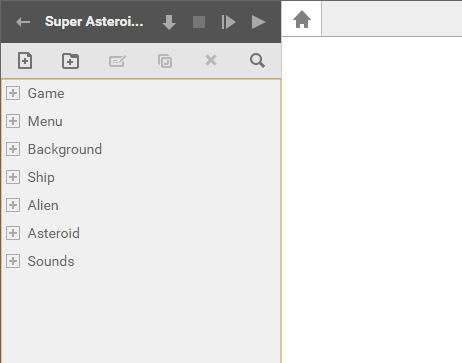
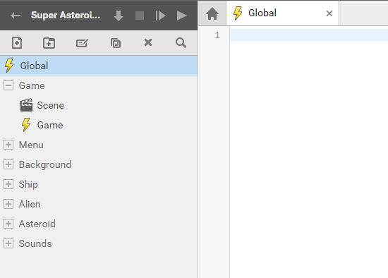
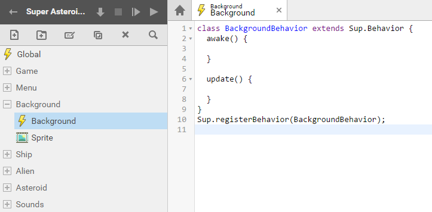
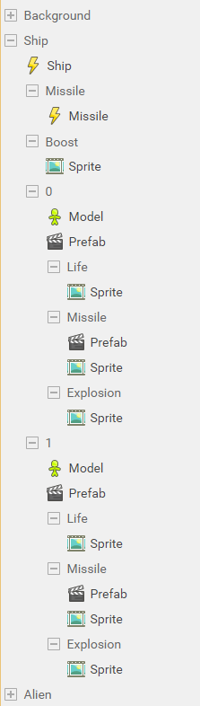
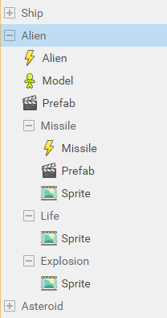
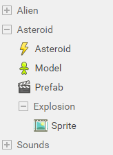
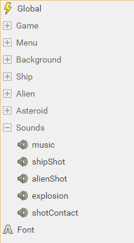

# SUPERPOWERS TUTORIAL #4
## SUPER ASTEROIDS and SUPER SPACEWAR, Chapter 2

### **Building the game structure**

As our game become bigger and more complex, it is very important to keep logical structure 
in all our game assets. If our scripts, sprites and others resources are well structured 
it will be easier for us to find them and use them as long we are building the game.

Everything in games are objects that we connect together in a common program. In our program
we want to be able to know what object is what with a quick glimpse. It is important to have a well
structured hierarchy and a consistent naming methodology. There is no an universal rule in the way we structure
game assets, for the tutorial we use one among many but as you build more games, you will follow your own 
conventions with which you feel the more comfortable.

For our game, we have a menu, a background, a player ship, an alien ship, many asteroids (copy of the same unique asteroid),
Sounds. We can also consider that our Main game is an object. Here, by creating differents folders, 
our basic structure with all the objects we will use :

We will now see the structure of each object and loads all assets related to it.

#### Game structure

First, our game will have a main script that contain the global datas and functions that we will use from
others scripts. (We can remove it's default content, it won't be an actor behavior)

Our game will also have a game management script that will concern the Game Behavior which is the main process 
of our game when it is running.

We can also create now the main game Scene.

* Global (script)
* Game (folder)
   * Scene (scene)
   * Game (script)

#### Menu Structure

To switch between our games inside the game, we will use the Menu. 

We need to create different assets :

The Menu/Scene which will be our Startup Scene, the Menu script which will contain the behavior logic of 
the menu and we will have differents screen Sprites in this scene.

* The **Main** screen which first appear and propose the choice of games.
* The **Asteroids** screen for the Super Asteroids game.
* The **Spacewar** screen for the Super Spacewar game.
* And the **GameOver** screen which appear when we finish or leave a game.

Also, we need a **Button** sprite for our menu buttons.

* Menu (folder)
   * Scene (scene)
   * Menu (script)
   * Screens (folder)
      * Main (folder)
         * Sprite (sprite)
      * Asteroids (folder)
         * Sprite (sprite)
      * Spacewar (folder)
         * Sprite (sprite)
      * GameOver (folder)
         * Sprite (sprite)
   * Button (folder)
      * Sprite (sprite)
      

   
*Note : Ultimately, the Menu/Scene will be set as the Startup Scene from the game settings, but because 
we develop our game first (and the menu as a polishing work) we can set the Game/Scene as the Startup Scene. 
When you do tests, you often need to start the game to see the results and to do so, jump directly where this result will appear.*

#### Background Structure

The background object contain the script with the background behavior and the sprite of this background.

* Background (folder)
   * Background (script)
   * Sprite (sprite)
   

#### Ship Structure

The ship object is the ship that control the player, for the Spacewar game, there is two different Ship which are mostly the same but with different textures.
We need to build a common structure for this two ships but make two branch for what differ for both.

First the most important which both ships are sharing is the behavior, we create a Ship script. The we create two differents folder for ship 1 and ship 2 (In programming we often 
use number starting to 0, it is why you will see ship 1 have the index 0 and ship 2 have the index of 1).

They have in common, the same missile behavior, we create a new script inside a Missile object (child object of the ship structure).

Also, they share the same sprite when moving, a sprite for the engine fire.

Now, what separate them :

We create for each a Model, which will contain the 3d model textured. We create a prefab scene which will set the ship inside a scene that we can use later. 
We need differents sprites for each ship, the life icon, the missile sprite and the ship explosion. We also need the prefab of the missile, which set the missile inside a scene.

* Ship (folder)
   * Ship (script)
   * Missile (folder)
      * Missile (script)
   * Boost (folder)
      * Sprite (sprite)
   * 0 (folder)
      * Model (3D model)
      * Prefab (scene)
      * Life (folder)
         * Sprite (sprite)
      * Missile (folder)
         * Prefab (scene)
         * Sprite (sprite)
      * Explosion (folder)
         * Sprite (sprite)
   * 1 (folder)
      * Model (3D model)
      * Prefab (scene)
      * Life (folder)
         * Sprite (sprite)
      * Missile (folder)
         * Prefab (scene)
         * Sprite (sprite)
      * Explosion (folder)
         * Sprite (sprite)

#### Alien Structure

For the alien ship we need to create an Alien behavior script, a 3D model and a prefab scene. 
The alien have, like the ship, differents sprite for its missile, life and explosion.

The missile object of alien object have also a script behavior and a prefab scene which set an individual missile 
and serve as a template than we use each time we need a missile to appear in the game.

* Alien (folder)
   * Alien (script)
   * Model (3D model)
   * Prefab (scene)
   * Missile (folder)
      * Missile (script)
      * Prefab (scene)
      * Sprite (sprite)
   * Life (folder)
      * Sprite (sprite)
   * Explosion (folder)
      * Sprite (sprite)

#### Asteroid Structure

The asteroid object has a behavior script, a prefab and a 3D model, it also has a sprite when exploding.

* Asteroid (folder)
   * Asteroid (script)
   * Model (3D model)
   * Prefab (scene)
   * Explosion (folder)
      * Sprite (sprite)
    

#### Sound Structure

The sounds contains sound assets :

* Sounds
   * music
   * shipShot
   * alienShot
   * explosion
   * shotContact

#### Font

Finaly, in the root of our structure we can add the Font asset that we will use for all our text and the user interface.
*(see screen with sounds)*

#### Complete structure :

See the [final chapter](ch12.md) for the complete reference source to see the complete game structure combined.

[<-- back to chapter 1](ch1.md) -- [go to chapter 3 -->](ch3.md)