# SUPERPOWERS TUTORIAL #4
## SUPER ASTEROIDS and SUPER SPACEWAR, Chapter 3

### **Loading and settings of assets**

First you need the sources files [here][1] to load assets, you can use them directly, modify or completly remake them, as you prefer. 
Anyway, we provide them ready to use if you want to jump directly in game development without consume too much time to create art assets.

We already have the structure, now, for each objet of our game we need to load the files in the assets and change the properties in a way
to keep a consistency for all our assets.

One decision we need to take in the beginning is the size of our game screen, we decide one unit will be 16 pixels and the screen will 30 units width and 30 units height.
Which is the same to say than our screen will be 480 width x 480 height. We can already put the Screen ratio 1 x 1 in the General settings.

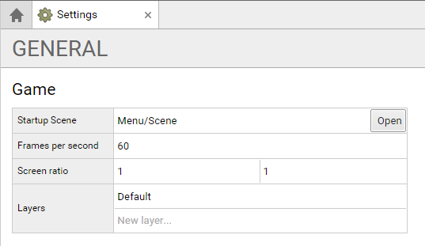

#### **Menu Assets**

We need to upload the files to each sprite and for each set the grid size to the size of the image and set the pixel/unit ratio:

* *Menu/Screens/Main/Sprite* with the file main.png for a grid size of 480 x 480 and 16 pixels/unit
* *Menu/Screens/Asteroids/Sprite* with the file asteroids.png for a grid size of 480 x 480 and 16 pixels/unit
* *Menu/Screens/Spacewar/Sprite* with the file spacewar.png for a grid size of 480 x 480 and 16 pixels/unit
* *Menu/Screens/GameOver/Sprite* with the file spacewar.png for a grid size of 480 x 480 and 16 pixels/unit

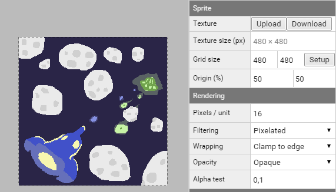

*Note : we can size the gride size with setup, and give the number of frame in row and column, it is a really useful way to set the grid for a sprite who contain animations. But in some
case like now, there is no animation and the sprite is only one frame, the grid size is then the same than the image size. (except the game over screen as we will see now)*

The gameover image contain three frames, for now we will separate this frames in different animations.
We create three statics animations with each one frame, we will use this frame later in the game to define the game over screen :

* **ship1** with the start and end frame to 0 
* **ship2** with the start and end frame to 1
* **alien** with the start and end frame to 2

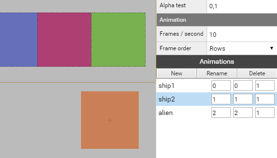

Like previously the button sprite is simply an upload of the file button.png with a grid size of the same size of the image (240 x 60) and a pixel/unit ration set at 16.

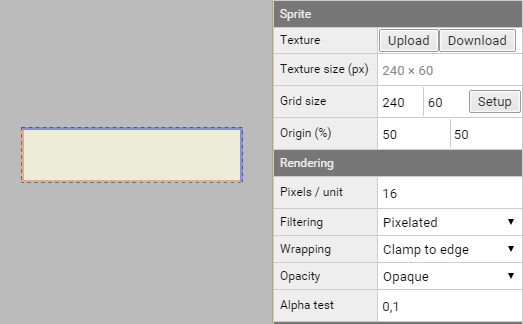

#### **Background Assets**

The background sprite is an upload of the file background.png with a grid size of the same size of the image (480 x 960) and a pixel/unit ration set at 16.

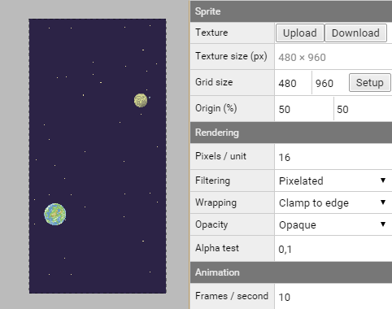

#### **Ship Assets**

##### **Ship 3D Models**

*Note : The game is a 2D game, but we use Superpowers 3D engine to start to play with simple 3D models, we will have 3D for the players ships, the alien ship and the asteroids. 
We use the format .obj exported from blender to upload it in superpowers.*

To the model of ship 1 (path : Ship/0/Model) we upload the ship.obj 3D model and the ship1texture.png.

We do the same for ship 2 (path : Ship/0/Model), we upload the same ship.obj and as texture we upload ship2texture.png.

We have now our two ships imported and ready to be used in our game :

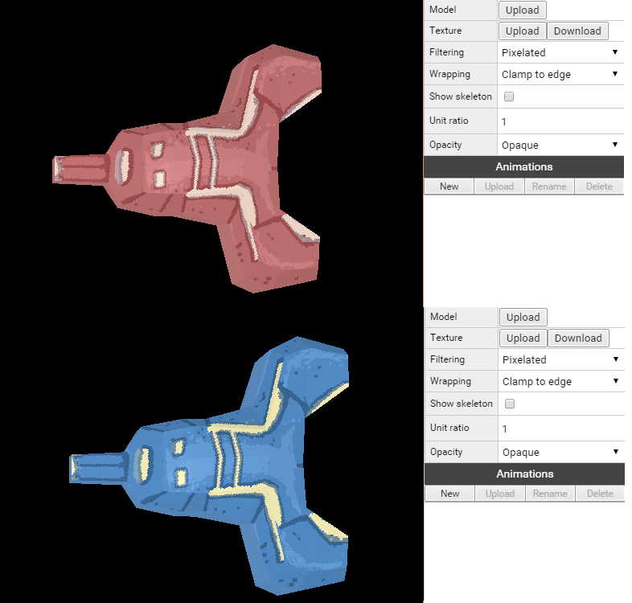

##### boost sprite
First the boost sprite apply to both ship, we upload the file boost.png and set the grid to 16 x 16, the origin to 50% and 100% (up and center), the pixel / units to 16.  
We then create two animations :

* **normal** with the start frame to position 0 and end frame to position 1.
* **fast** with the start frame to position 2 and end frame to position 3.

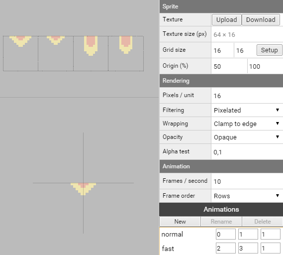

We now load and set the assets two times, for the ship 1 and ship 2 (path : Ship/0 and Ship/1)

##### life sprite

Life sprites, upload the ship1life.png for ship 1 and ship2life.png for ship 2, both have a grid size of 16 x 16, and pixel / unit ratio of 16.  
Life sprites have 2 animations with one frame each :

* **full** with the start and end frame to position 0.
* **empty** with the start and end frame to position 1.

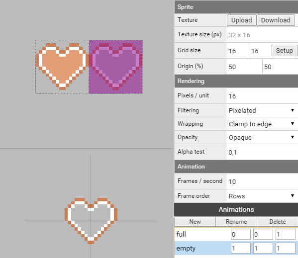

##### missile sprite

Missile sprites, upload the ship1missile.png for ship 1 and ship2missile.png for ship 2, both have a grid size of 16 x 16, and pixel / unit ratio of 16.  
Missile sprites have 1 animation :

* **explode** with the start frame to position 1 and end frame to position 3.

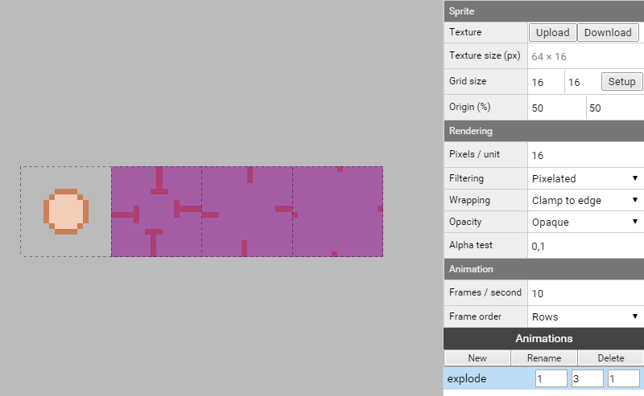

##### explosion sprite

Like before, Explosion sprites, upload the ship1explosion.png for ship 1 and ship2explosion.png for ship 2, both have a grid size of 16 x 16, and pixel / unit ratio of 16.  
Explosion sprites have 1 animation :

* **explode** with the start frame to position 0 and end frame to position 5.

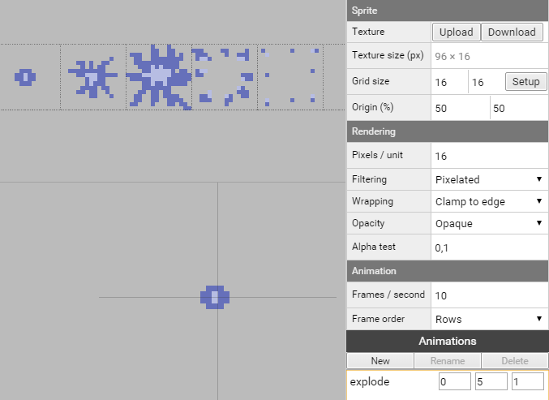

#### **Alien assets**

##### Alien 3D Model

We upload the alien.obj model and the alienTexture.png in our Alien/Model.
 
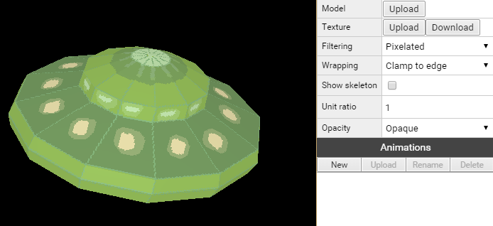

The alien sprites life, missile and explosion have the same parameters than for the ship :

##### life sprite

For the life sprite, we upload the alienLife.png with a grid size of 16 x 16, and pixel / unit ratio of 16.  
Like for the ship, life sprites have 2 animations with one frame each :

* **full** with the start and end frame to position 0.
* **empty** with the start and end frame to position 1.

##### missile sprite

For the missile sprite, we upload the alienMissile.png with a grid size of 16 x 16, and pixel / unit ratio of 16.  
Missile sprite have 1 animation :

* **explode** with the start frame to position 1 and end frame to position 3.

##### explosion sprite

With the ship explosion sprite we upload the alienExplosion.png with a grid size of 16 x 16, and pixel / unit ratio of 16.  
Explosion sprite have 1 animation :

* **explode** with the start frame to position 0 and end frame to position 5.

#### **Asteroid Assets**

##### Asteroid 3D Model

We upload the the path Asteroid/Model the asteroid.obj model with the texture asteroidTexture.png.

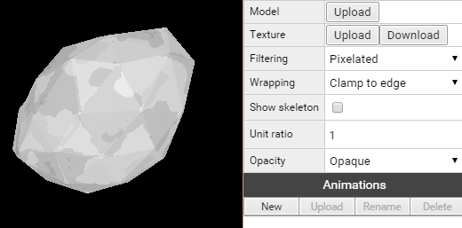

##### explosion sprite

Like the ship and alien, the asteroids have an explosion sprite, we upload the asteroidExplosion.png with a grid size of 16 x 16, and pixel / unit ratio of 16.  
Explosion sprite have 1 animation :

* **explode** with the start frame to position 0 and end frame to position 5. 

#### **Sounds**

We upload for each sounds the sound file related. // music and sound are still in development

#### **Font**

We change the Font Type to bitmap and upload the Texture Font.png.

We then change the grid size to 20 x 20 and the pixel / unit ration to 16.

*Note : The font is made by Pixelboy of Sparklinlab and have the same licence than the rest of the tutorial CC0*

[1]:https://github.com/mseyne/superpowers-sources/tree/master/4SuperAsteroids

[<-- back to chapter 2](ch2.md) -- [go to chapter 4 -->](ch4.md)